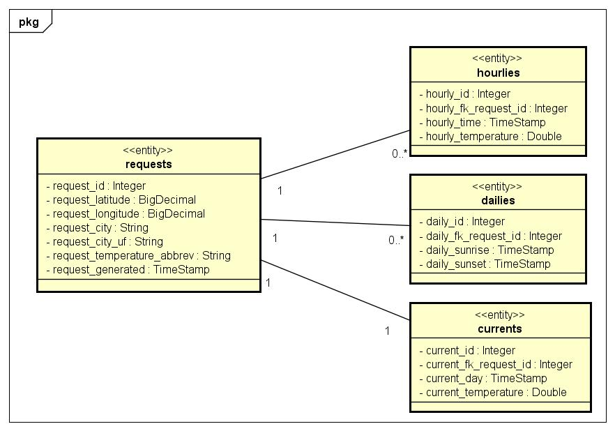

# Weather Project - Desafio Técnico

> **"Labor omnia vincit improbus"** - A perseverança vence tudo!

## 📋 Descrição do Projeto

Este projeto é um **Desafio Técnico** que implementa uma solução completa de **ETL (Extract, Transform, Load)** para dados meteorológicos, integrando extração de dados de APIs públicas com uma API REST robusta para consulta dos dados armazenados.

### 🎯 Objetivos
- **Extração de dados** de uma API pública de clima e tempo (OpenMeteo)
- **Transformação e armazenamento** dos dados em banco de dados
- **Construção de uma API REST** com endpoints para consulta dos dados processados

## 🔄 Fluxo de Dados

1. **Extração**: O script Python coleta dados meteorológicos da API OpenMeteo
2. **Transformação**: Os dados são processados e estruturados
3. **Carregamento**: Informações são persistidas no banco PostgreSQL
4. **Consulta**: A API REST disponibiliza endpoints para acesso aos dados

## 📊 Funcionalidades

- ✅ Extração automatizada de dados meteorológicos
- ✅ Armazenamento estruturado em banco de dados
- ✅ API REST com endpoints documentados
- ✅ Containerização completa com Docker
- ✅ Interface de documentação com Swagger
- ✅ Collection Postman para testes


## 🏗️ Arquitetura do Sistema



O diagrama acima apresenta as entidades do sistema e seus relacionamentos, demonstrando a estrutura de dados utilizada para armazenar as informações meteorológicas.

## 🛠️ Tecnologias Utilizadas

### ETL Script
- **Python 3.13** - Script de extração e processamento de dados
- **OpenMeteo API** - API pública gratuita (sem necessidade de token)
- 📖 [Documentação detalhada do ETL](pythonETL/README.md)

### API REST
- **Java** com **Spring Boot 3.5.4** - Framework para construção da API
- **PostgreSQL** - Banco de dados relacional
- **Docker** - Containerização da aplicação
- 📖 [Documentação detalhada da API](api-weather/README.md)

## 🚀 Como Executar o Projeto

### Pré-requisitos

#### Linux (Recomendado)
```bash
# Instalar Docker e Docker Compose
sudo apt update
sudo apt install docker.io docker-compose
```

#### Windows
É necessário instalar o **Docker Desktop**:
- [Download Docker Desktop para Windows](https://desktop.docker.com/win/main/amd64/Docker%20Desktop%20Installer.exe)
- [Página oficial do Docker Desktop](https://www.docker.com/products/docker-desktop/)

### Execução

1. **Clone o repositório:**
```bash
git clone https://github.com/eliasneri/weatherProject.git
```

2. **Acesse a pasta do projeto:**
```bash
cd weatherProject
```

3. **Execute o Docker Compose:**
```bash
# Iniciar os serviços
docker-compose up -d

# Verificar status dos containers
docker-compose ps

# Parar os serviços
docker-compose down
```

## 📡 Acessando a API

### Swagger UI
Acesse a documentação interativa da API através do Swagger:
```
http://localhost:9090/swagger-ui/index.html
```

### Postman Collection
Alternativamente, você pode importar a collection do Postman localizada em:
```
documents/collectionPostman/WeatherProject.postman_collection.json
```

## 🏆 Diferencial do Projeto

- **Sem dependência de tokens** - Utilização da OpenMeteo API gratuita
- **Arquitetura moderna** - Microserviços com Docker
- **Documentação completa** - Swagger e README detalhados
- **Fácil execução** - Docker Compose com um comando
- **Código limpo** - Seguindo boas práticas de desenvolvimento

---

### 📞 Contato
Este projeto foi desenvolvido como parte de um desafio técnico, demonstrando competências em ETL, APIs REST, containerização e boas práticas de desenvolvimento.

**Repositório:** https://github.com/eliasneri/weatherProject.git

**E-mail:** eliasneri@hotmail.com